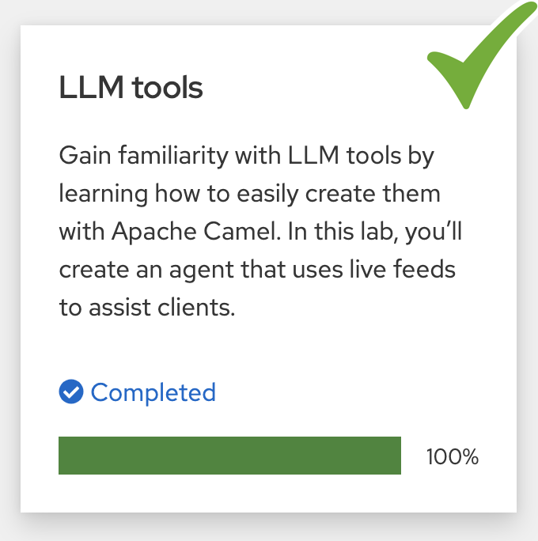
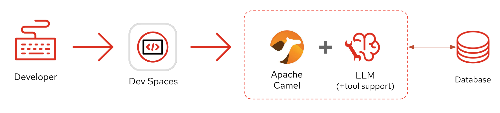
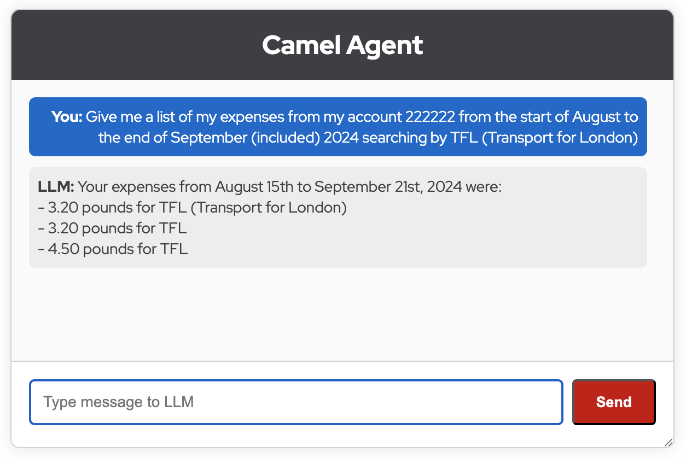
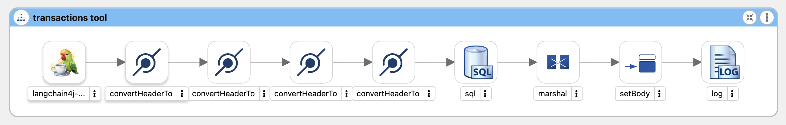

:walkthrough: Lab Introduction
:user-password: openshift
:namespace: {user-username}

:experimental:

:article-url: https://developers.redhat.com/articles/2024/09/26/tutorial-tool-your-llm-apache-camel-openshift

:ai-basics-article-url: https://developers.redhat.com/articles/2024/07/22/try-openshift-ai-and-integrate-apache-camel

:eip-explorer-url: https://camel.solutionpatterns.io/#

// WORKS
:style-kbd: kbd { \
  color: black; \
  background-color: lightgrey; \
  border: 1px solid black; \
  box-shadow: 0px 1px black; \
  font-size: .85em; \
  line-height: .85em; \
  display: inline-block; \
  font-weight: 600; \
  letter-spacing: .05em; \
  padding: 3px 5px; \
  white-space: nowrap; \
  border-radius:5px; \
} \

:style-preview: pre {background-color: black; color: white}

:style-indent: .indent2 {padding-left: 2rem;}

:style-all: pass:a[]

// :btn-text: my text
// :btn: pass:attributes[<code><mark style="background-color: dodgerblue; color: white">&nbsp;{btn-text}&nbsp;</mark>]

ifdef::env-github[]
endif::[]

[id='lab-intro']
= LLM tools - (Bonus Track)

Exploit the super weapon of LLM Tools. Allow users to use natural language to retrieve expenses from their bank account. 

This is an extension exercise and you must complete first *LLM tools* as a prerequisite. +
Make sure you've completed the previous *LLM tools* chapter:

{blank}

{empty} +

The picture below illustrates the journey the lab will take you on.
The mission of this bonus exercise is to create an LLM tool with _Camel_ that will integrate with a database to allow the LLM to retrieve transactions data.

{blank}

{blank}

The key difference between the proposed use case and traditional applications is that instead of retrieving information using well pre-defined schemas and data formats, here the interface is natural language. The user uses human language asking for the data it needs and Camel+LLM do the rest.

{empty} +

[time=14]
[id="bonus-exercise"]
== Create a Transactions tool
{style-all}

Ensure the following prerequisites are met:

 - You've completed the *LLM tools* chapter
 - Your LLM server is still running
 - Your workspace is open and ready

{empty} +

=== Introduction

The mission of this bonus exercise is to create an LLM tool with _Camel_ that will integrate with a database to allow the LLM to retrieve transactions data.

This exercise will be slightly less prescriptive to encourage you to find your way to implement the solution.

The end goal is to use natural language to obtain information from the system. From the Chat UI (built in previous chapter), the sentence below is the sort of request the user will typing in:

[quote]
Give me a list of my expenses from my account 222222 from the start of August to the end of September (included) 2024 searching by TFL (Transport for London)

{empty} +

=== Setup

[IMPORTANT]
====
If Camel is still running, stop it with kbd:[Ctrl+c] and setup the lab stage by running the following command:

[source, subs=]
----
step 4 
----

NOTE: For this bonus exercise we will reuse the conditions of Step 4, where everything is ready for you to create an LLM tool.
====

{empty} +

=== Inspect the Database

First of all, see by yourself the data that is available in the database by running the following command:

[source, subs=]
----
oc exec -n shared svc/postgresql -- psql -d demo -c 'select * from transactions' 
----

NOTE: The command above is connecting to the database service and running an SQL command to retrieve all the rows in the table.

{blank}

You should see an output showing the entries in the database table similar to the following:

----
id | account |    date    | description | amount 
----+---------+------------+-------------+--------
  1 | 111111  | 2024-05-03 | Pret        |   5.69
  2 | 111111  | 2024-05-08 | Foods       |  25.85
  3 | 111111  | 2024-05-10 | Pret        |  16.79
  4 | 111111  | 2024-05-26 | Cinema      |  20.00
  5 | 111111  | 2024-05-29 | Foods       |  54.20
  6 | 111111  | 2024-06-14 | Pret        |   4.25
  7 | 111111  | 2024-06-15 | Pret        |  14.25
  8 | 111111  | 2024-06-16 | Pret        |   8.75
  9 | 111111  | 2024-07-01 | Post Office |   1.25
  ...
----

{blank}

The database has been populated with data for 2 accounts:

 - `111111`
 - `222222`

{empty} +

=== Create the Skeleton

From your `lab` directory, create a new file using the command below:

[source, subs=]
----
touch route-tool-transactions.camel.yaml 
----

NOTE: This will result in creating an empty file.

{blank}

Open the file in text mode and copy/paste the following YAML content:

[source, subs=]
----
- beans:
    - name: PostgresqlDataSource
      properties:
        databaseName: demo
        password: camel
        portNumber: "5432"
        serverName: postgresql.shared.svc
        user: camel
      type: org.postgresql.ds.PGSimpleDataSource
- route:
    from:
      uri: timer:template
      parameters:
        repeatCount: "1"
      steps:
        - log:
            message: ${body}
----

NOTE: You will observe the YAML above contains a Bean definition to connect to the database, and a basic timer-to-log _Camel_ route.

{empty} +

=== Data retrieval

Open the skeleton definition using Kaoto.

Your first task is to retrieve all the information from the database to validate access to the data.

Add a new step after the _Timer_ activity, and choose from the catalogue the *SQL (sql)* _Camel_ component.

Then, configure the following properties:

- *Query*: `select * from transactions`
- *Data Source*: `#PostgresqlDataSource`  

{blank}

After you finish with the definition, run it with:

[source, subs=]
----
camel run route-tool-transactions.camel.yaml 
----

{blank}

After _Camel_ starts up, it will fire a timer event and will execute the SQL action. You should see an output in your terminal rendering all the rows from the DB table, similar to:

----
... : Apache Camel 4.8.1 (route-tool-transactions) started in 673ms (build:0ms init:0ms start:673ms)
... : [{id=1, account=111111, date=2024-05-03, description=Pret, amount=5.69}, {id=2, account=111111, date=2024-05-08, description=Foods, amount=25.85}, ...
----

{empty} +

=== Create the Transactions Tool

NOTE: Make sure you stop Camel with kbd:[Ctrl+c].

{blank}

You'll now resume your work my making updates on your Camel route containing your SQL action.

. Redefine the `from` definition
+
--
. Replace your _Timer_ activity with a _LangChain4j_ Tools
. Make sure you use the following *Endpoint Properties*:
+
- Tool Id: `transactions`
- Tags: `all`
- Description: `get account transactions`
+
. And include the following _Name/Value_ parameters:
+
- `account`: `number`
- `from`: `date`
- `to`: `date`
- `filter`: `string`

{empty} +

At runtime, the above tool input parameters are populated as headers when the LLM calls the tool. Their underlying Java class is a JSON type which the SQL component does not like.

[IMPORTANT]
====
Make sure you include a *Convert Header To* processor for each one of the parameters, using the following properties:

- *Name*: <name of parameter>
- *Type*: use `String`
====
--
+
{empty} +

. Update the SQL query to take parameters in.
+
--
The LLM will invoke the tool passing the 4 defined parameters. You need to update the SQL query to map them in.

Copy and paste the SQL query below to replace the existing `SELECT` statement:

[source, subs=]
----
SELECT TO_CHAR(date, 'dd/mm/yyyy'),amount FROM transactions where account = :#account AND date BETWEEN date(:#from) AND date(:#to) and :#filter like concat(description,'%')
----
--
+
{empty} +

. Render the SQL result in JSON.
+
--
The Camel SQL component returns a Java object populated with the data returned from the database.

Add a *Marshal* step, using the Json _DataFormat_ to convert the result from a Java object to JSON data.
--
+
{empty} +

. Prepare the data to return to the LLM 
+
--
Add a *Set Body* _Camel_ processor, placed after the _Marshal_ step.

Use the following Simple expression:

[source, subs=]
----
{"result": ${body}}
----
--

{empty} +

And you should be good to go !!

{empty} +

=== Test the new Transactions Tool

Start Camel with:

[source, subs=]
----
camel run * 
----

{blank}

Open the Chat UI and enter the following query:

[source, subs=]
----
Give me a list of my expenses from my account 222222 from the start of August to the end of September (included) 2024 searching by TFL (Transport for London)
----

{empty} +

After a few seconds, you should obtain a response similar to:

{blank}

If you managed to get from the LLM the response you expected:

👏 👏 👏 Congratulations for getting this far 👏 👏 👏

{blank}

TIP: If you have problems with your newly created tool and you are not getting the results you expected, you can see the solution in the next section. +
Click `pass:[<mark style="background-color: dodgerblue; color: white">&nbsp;Next&nbsp;</mark>]` to see the full definition.

{empty} +

[time=1]
[id="solution"]
== See the Solution
// == Take the solution further ahead
{style-all}

This is how your Camel route should look like in Kaoto:

{blank}

In the route above you'll see the LangChain4j Tools component followed by 4 `convertHeaderTo` steps to enforce the `String` _Java_ type to ensure the parameters are given to the SQL component as strings.

The code snippet below shows you the full YAML definition used for the diagram above:

----
- beans:
    - name: PostgresqlDataSource
      properties:
        databaseName: demo
        password: camel
        portNumber: "5432"
        serverName: postgresql.shared.svc
        user: camel
      type: org.postgresql.ds.PGSimpleDataSource
- route:
    from:
      uri: langchain4j-tools:transactions
      parameters:
        description: get account transactions
        parameter.account: number
        parameter.from: date
        parameter.to: date
        parameter.filter: string
        tags: all
      steps:
        - convertHeaderTo:
            name: account
            type: String
        - convertHeaderTo:
            name: from
            type: String
        - convertHeaderTo:
            name: to
            type: String
        - convertHeaderTo:
            name: filter
            type: String
        - to:
            uri: sql:SELECT TO_CHAR(date, 'dd/mm/yyyy'),amount FROM transactions where
              account = :#account AND date BETWEEN date(:#from) AND date(:#to)
              and :#filter like concat(description,'%')
            parameters:
              dataSource: "#PostgresqlDataSource"
        - marshal:
            json: {}
        - setBody:
            expression:
              simple:
                expression: '{"result": ${body}}'
        - log:
            message: ${body}
----

NOTE: The YAML code above includes both the bean definition and the full Camel route.

{empty} +

If you encountered troubles with your implemented route, open in your editor the Camel file in text mode and replace its contents with the solution given above. Restart _Camel_ and try again.

{empty} +

[type=verification]
Did your LLM successfully respond with real database data?

[type=verificationSuccess]
Fabulous!

[type=verificationFail]
The LLM may have hallucinated. Please try again modifying slightly your request.
